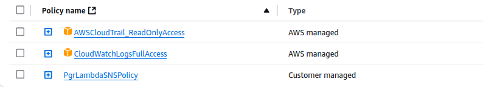

# Lambda Function To Notify Root Logins

To receive live notifications only for root user logins in AWS, you need to adjust the setup slightly to focus on identifying when the root user logs into the AWS Management Console. The root user login events can be captured through CloudTrail, and by filtering the events based on the userIdentity attribute (which will have userType as Root), we can specifically target these events.

Here's a step-by-step guide to set up real-time notifications for root user logins:
### 1. Create SNS Topic for Notifications

First, create an SNS topic where notifications will be sent when a root user logs in.
```
    Go to the SNS Console.
    Click Create topic.
    Select Standard as the topic type.
    Provide a name for the topic (e.g., RootUserLoginNotifications).
    Click Create topic.
```
After the topic is created, you’ll see the Topic ARN (e.g., arn:aws:sns:region:account-id:RootUserLoginNotifications). This ARN is required for sending notifications.
```
    Add a subscription to the SNS topic:
        Click on Create subscription.
        Choose the Protocol (e.g., Email).
        Enter your email address or another endpoint to receive the notifications.
        Click Create subscription and confirm your subscription.
```
### 2. Create CloudWatch Event Rule for Root User Logins

Next, create a CloudWatch Event rule that filters for login events specifically from the root user.
```
    Go to the CloudWatch Console.
    In the left-hand menu, click Rules and then click Create rule.
    Under Event Source, select AWS service and choose CloudTrail.
    Select Specific event(s) in the Event Pattern section.
```
Enter the following event pattern to filter for ConsoleLogin events related to the root user:
```json
{
  "source": ["aws.signin"],
  "detail-type": ["AWS Console Sign In via CloudTrail"],
  "detail": {
    "userIdentity": {
      "type": ["Root"]
    },
    "eventName": ["ConsoleLogin"]
  }
}
```
This pattern ensures that only ConsoleLogin events performed by the root user will trigger the event.
```
    In the Targets section, select Lambda function and choose the Lambda function you will create or update in the next step.

    Click Create to save the rule.
```
### 3. Create or Update Lambda Function to Send Notifications

Now, update the Lambda function that processes these events and sends notifications via SNS.
```
    Go to the Lambda Console.
    If you haven’t created the Lambda function yet, create a new one with the Python runtime (or any other language you prefer).
    Update the Lambda function code to handle CloudWatch events triggered by root user logins.
```
Here’s an example Lambda function that will receive the event from CloudWatch and send a notification to SNS:
```python
import json
import boto3

def lambda_handler(event, context):
    print(event)
    # Create SNS client
    sns_client = boto3.client('sns')
    
    # Extract root user login details from the CloudWatch event
    user_name = event['detail']['userIdentity'].get('userName', 'Unknown')
    login_status = event['detail']['responseElements'].get('ConsoleLogin', 'Failure')
    source_ip = event['detail'].get('sourceIPAddress', 'Unknown')
    event_time = event['detail'].get('eventTime', 'Unknown')
    
    # Create the notification message
    message = f"Root User Login Attempt:\n"
    message += f"User: {user_name}\n"
    message += f"Login Status: {login_status}\n"
    message += f"Source IP: {source_ip}\n"
    message += f"Event Time: {event_time}\n"

    # SNS Topic ARN (replace with your SNS topic ARN)
    sns_topic_arn = 'arn:aws:sns:us-east-1:851725172472:RootUserLoginNotifications'

    # Send the notification via SNS
    sns_response = sns_client.publish(
        TopicArn=sns_topic_arn,
        Message=message,
        Subject="AWS Root User Login Notification"
    )
    
    return {
        'statusCode': 200,
        'body': json.dumps('Notification sent successfully')
    }

```
Key Points in the Lambda Function:
```
    SNS Client: The function uses the boto3 SNS client to send notifications.
    Extract Root Login Info: It extracts key details from the event, such as the user name, login status (ConsoleLogin success or failure), source IP address, and the event time.
    SNS Topic ARN: The TopicArn is the SNS topic you created earlier, where notifications will be sent.
    
```
 ```json
{
    "Version": "2012-10-17",
    "Statement": [
        {
            "Effect": "Allow",
            "Action": [
                "sns:Publish"
            ],
            "Resource": "arn:aws:sns:us-east-1:851725172472:RootUserLoginNotifications"
        }
    ]
}
```

### 4. Add Permissions to Lambda Function

Ensure that your Lambda function has the necessary permissions to publish to SNS. Attach the following permissions to the Lambda execution role:
```
    Go to the IAM Console.
    Find the IAM role associated with your Lambda function.
    Attach the following managed policy: AmazonSNSFullAccess ,  or create a custom policy that allows sns:Publish action for the SNS topic ARN and access to CloudTrail, CloudWatch.
```
### 5. Test the Setup

To test the setup:
```
    Log in as the root user: Perform a login to the AWS Console using the root user account.
    Check for Notifications: You should receive an email (or another notification) via SNS, informing you about the root user login attempt.
```
### 6. Monitor and Adjust the Setup

    You can monitor CloudWatch logs to verify that the CloudWatch Event Rule is triggering as expected.
    If you want to track failed root user logins, you can adjust the event filter to only notify on failed logins by inspecting the ConsoleLogin event's responseElements field for a failure.